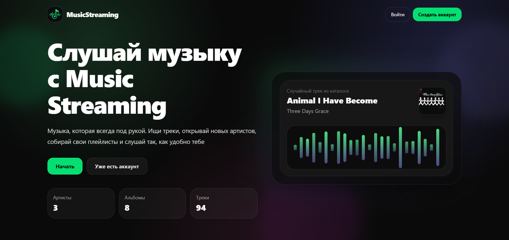
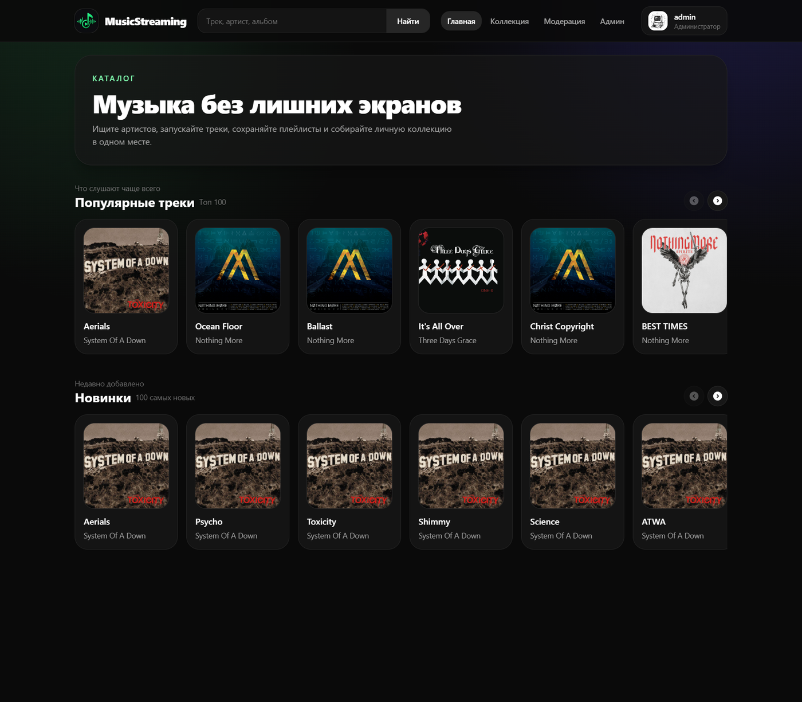
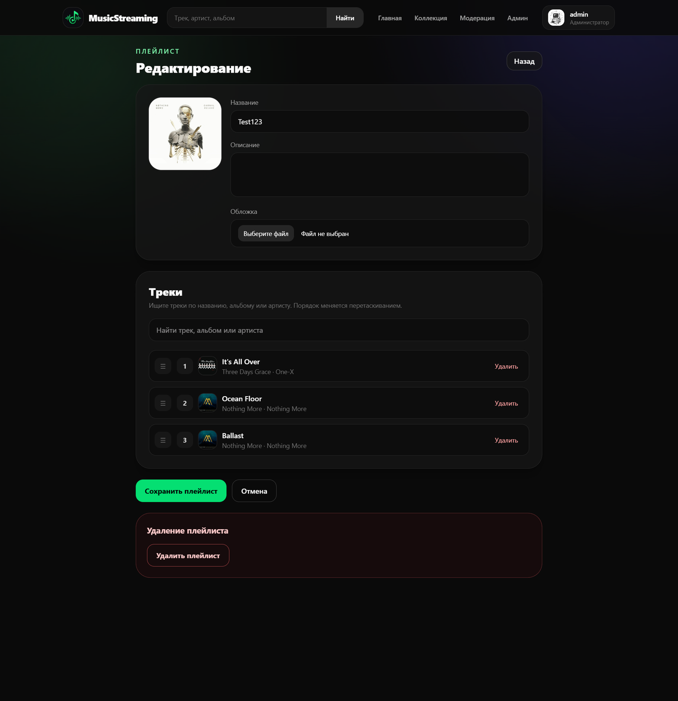
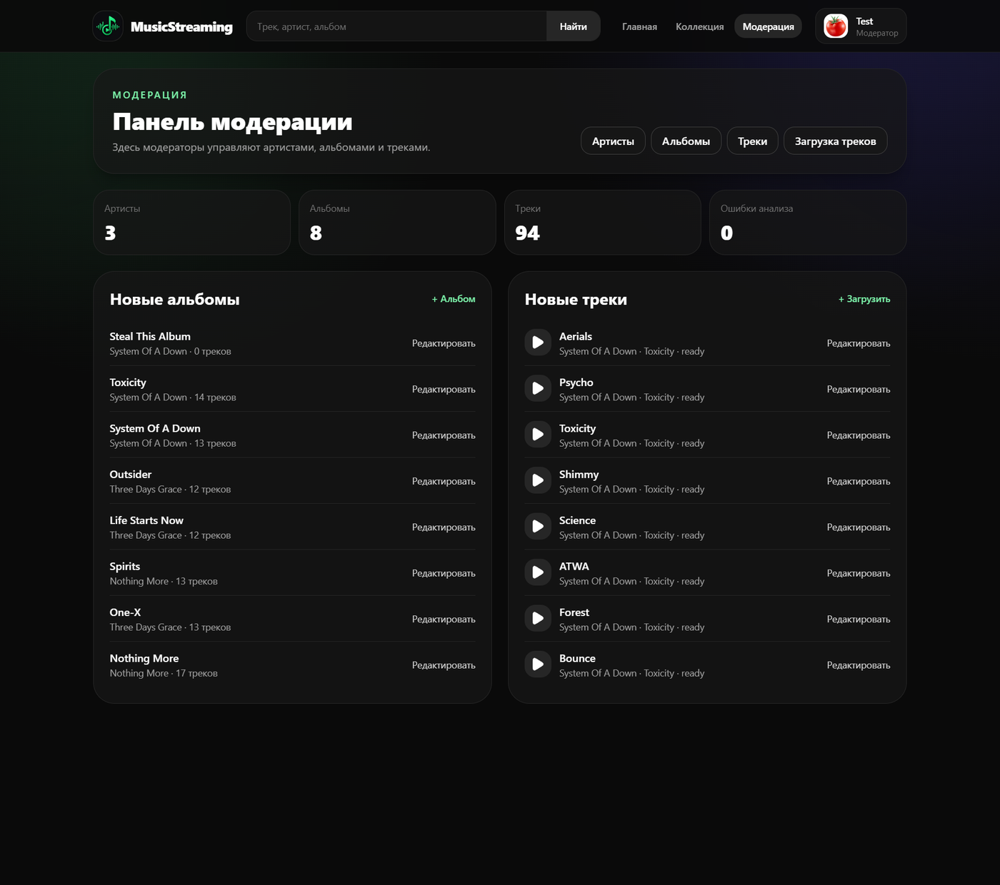
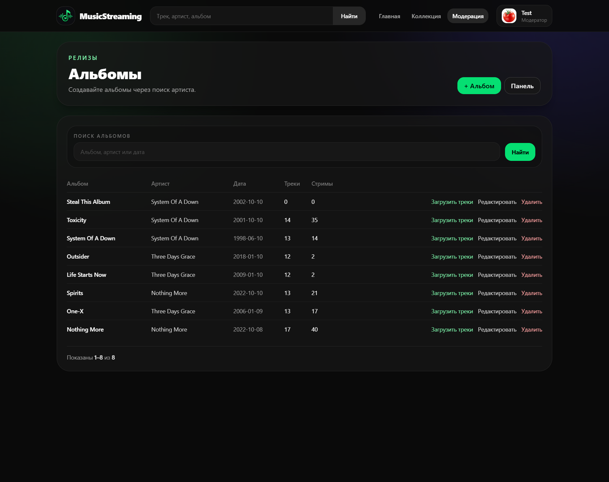
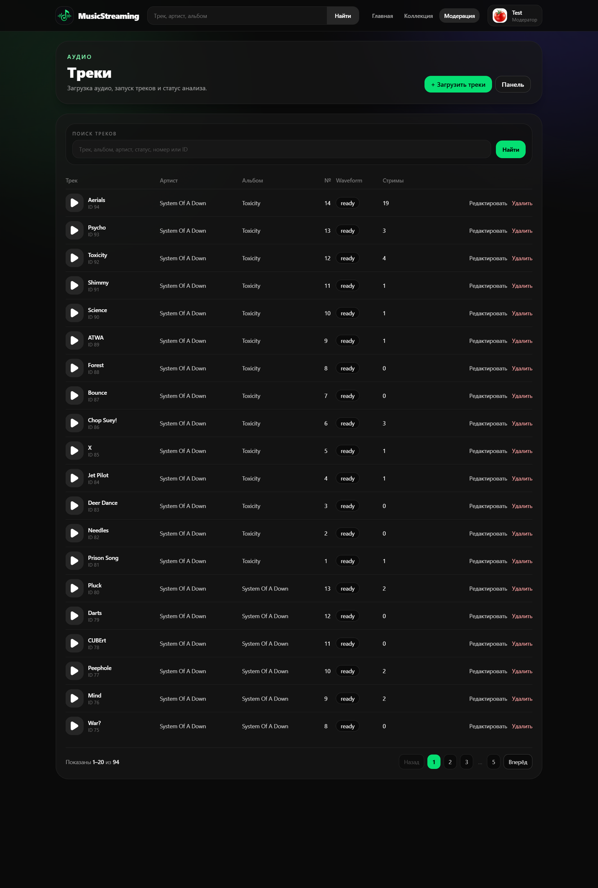
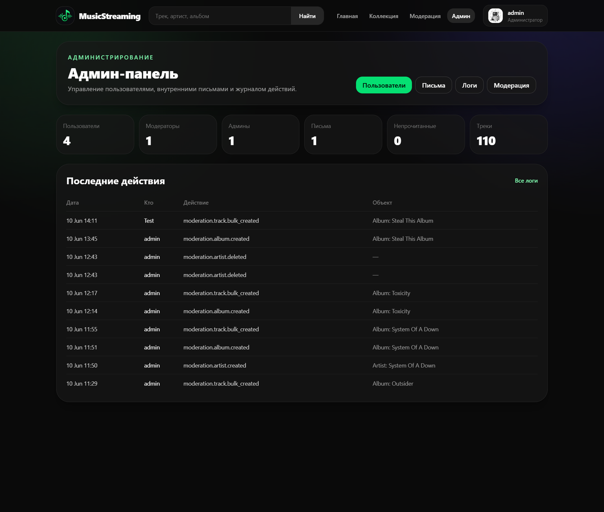
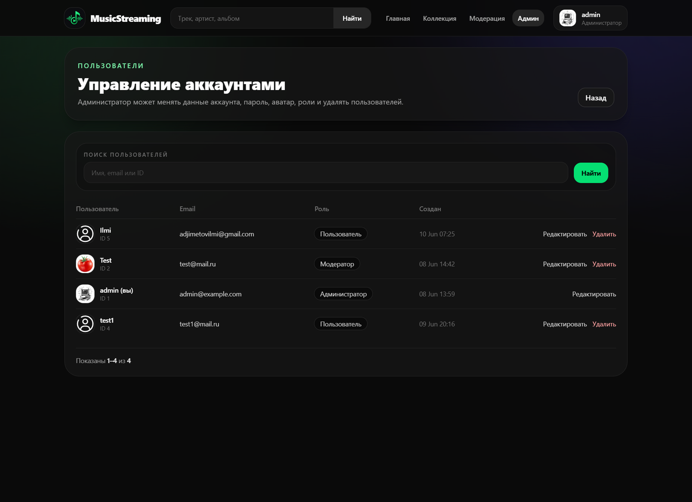
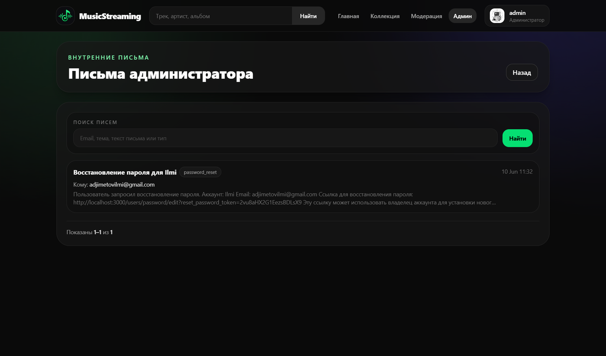

  <h1>MusicStreaming</h1>
  
  <p>
    Музыкальный стриминговый сервис с потоковым воспроизведением,
    плейлистами, поиском, плеером и отдельными панелями модерации и администрирования.
  </p>

  <p>
    
    
    
    
    
  </p>

---

## О сервисе

**MusicStreaming** — это веб-сервис для прослушивания музыки. Пользователь может искать треки, артистов и альбомы, слушать музыку через нижний плеер, создавать плейлисты и собирать собственную коллекцию.

Сервис разделяет обычных слушателей, модераторов и администратора. Модераторы управляют музыкальным каталогом: создают артистов, альбомы и массово загружают треки. Администратор управляет пользователями, ролями, логами и внутренними системными письмами.

---

## Возможности

### Для слушателей

- регистрация и вход по email или логину;
- адаптивный лендинг для гостей;
- главная страница с популярными и новыми треками;
- отдельные страницы **Топ 100** и **100 новых треков**;
- live-поиск по артистам, альбомам и трекам;
- потоковое воспроизведение аудио без полной загрузки файла;
- нижний плеер с waveform, громкостью, перемоткой и очередью;
- поддержка кнопок гарнитуры через Media Session API;
- создание и редактирование плейлистов;
- добавление треков в плейлист из карточки трека или из плеера;
- личная коллекция пользователя;
- настройки аккаунта и аватар.

### Для модераторов

- отдельная панель модерации;
- управление артистами;
- управление альбомами;
- массовая загрузка треков drag & drop;
- ручное редактирование названий и номеров треков перед загрузкой;
- сортировка треков через drag-handle;
- запуск треков прямо из модерации;
- поиск и пагинация по спискам.

### Для администратора

- отдельная админ-панель;
- управление пользователями;
- изменение имени, email, пароля, роли и аватара пользователя;
- удаление аккаунтов;
- защита от удаления самого себя и последнего администратора;
- просмотр audit logs;
- внутренние письма для восстановления доступа;
- пагинация и поиск в административных таблицах.

---

## Скриншоты

### Главная и прослушивание

<p align="center">
  
</p>

### Топы и плейлисты

<table>
  <tr>
    <td width="50%">
      
    </td>
    <td width="50%">
      
    </td>
  </tr>
</table>


### Панель модерации

<table>
  <tr>
    <td width="33%">
      
    </td>
    <td width="33%">
      
    </td>
    <td>
      
    </td>
  </tr>
</table>


### Админ-панель

<table>
  <tr>
    <td width="33%">
      
    </td>
    <td width="33%">
      
    </td>
    <td>
        
    </td>
  </tr>
</table>

<p align="center">
  </p>

---

## Роли пользователей

| Роль | Возможности |
| --- | --- |
| **Гость** | Просмотр лендинга, регистрация, вход, запрос восстановления доступа |
| **Пользователь** | Прослушивание музыки, поиск, плейлисты, коллекция, настройки аккаунта |
| **Модератор** | Управление артистами, альбомами и треками |
| **Администратор** | Все права модератора, управление пользователями, ролями, логами и письмами |

---

## Технологии

| Категория       | Используется |
|-----------------| --- |
| Backend         | Ruby on Rails |
| Аутентификация  | Devise |
| Авторизация     | Pundit |
| База данных     | PostgreSQL |
| Файлы           | Active Storage |
| Frontend        | Hotwire Turbo, Stimulus |
| Стили           | Tailwind CSS |
| Сборка JS       | esbuild |
| Контейнеризация | Docker Compose |
| Анализ аудио    | FFmpeg / Sidekiq jobs |

---

## Быстрый запуск

### 1. Клонировать репозиторий

```bash
git clone https://github.com/username/MusicStreaming.git
cd MusicStreaming
```

### 2. Запустить через Docker Compose

```bash
docker compose up --build
```

После запуска приложение будет доступно по адресу:

```text
http://localhost:3000
```


## Аккаунт администратора по умолчанию

После seed создаётся администратор:

```text
login: admin
email: admin@example.com
password: admin123
```

После первого входа пароль лучше изменить через админ-панель.

---

## Основные маршруты

| Страница | URL |
| --- | --- |
| Лендинг | `/` |
| Главная приложения | `/pages` |
| Поиск | `/search` |
| Топ 100 | `/top-tracks` |
| 100 новых треков | `/new-tracks` |
| Коллекция | `/collection` |
| Модерация | `/moderation` |
| Админ-панель | `/admin` |
| Внутренние письма | `/admin/mail_messages` |

---

## Работа с треками

Треки загружаются модераторами через массовую загрузку:

1. выбирается альбом через поиск;
2. аудиофайлы перетаскиваются в upload-зону;
3. названия автоматически берутся из имён файлов;
4. модератор может отредактировать названия и номера треков;
5. порядок можно менять drag & drop через специальную ручку;
6. после загрузки треки отправляются на фоновый анализ;
7. waveform сохраняется и используется плеером без повторного скачивания полного аудиофайла.

---


## Пагинация и фильтры

В админке и модерации списки разбиты по **20 записей на страницу**. Поиск-фильтр есть на страницах:

- пользователи;
- audit logs;
- внутренние письма;
- артисты;
- альбомы;
- треки.

При переходе по страницам текущий фильтр сохраняется.

---


## Структура проекта

```text
app/
  controllers/       # Rails controllers
  javascript/        # Stimulus controllers и frontend logic
  models/            # ActiveRecord models
  policies/          # Pundit policies
  views/             # ERB templates
config/
  routes.rb          # Маршруты приложения
db/
  migrate/           # Миграции базы данных
  seeds.rb           # Начальные данные
docs/readme/         # Скриншоты для README
```

---

## Планы на развитие

- публичные плейлисты и подписки на плейлисты;
- рекомендации по жанрам и истории прослушивания;
- расширенная аналитика прослушиваний;
- комментарии или реакции на релизы;
- полноценная система уведомлений;

---
